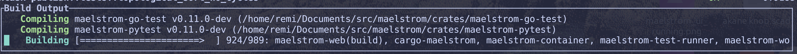
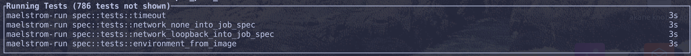
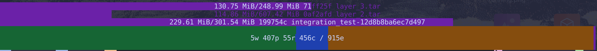

+++
title = "Maelstrom 0.11.0 Release"
date = 2024-07-23
weight = 1000
draft = true
+++

This release we are announcing two main things. These are an **overhaul of our test-runner terminal
UI**, and a **new test-runner for the Go programming language**.

<!-- more -->

See the [0.11.0 release notes](https://github.com/maelstrom-software/maelstrom/releases/tag/v0.11.0) for a
complete list of changes. This post give a tour of the two biggest things.

## The New Terminal UI

We've overhauled our terminal UI to deliver some features we are very excited about.

These improvements apply to all our test runners even the new <tt>maelstrom-go-test</tt>. Also you
don't have to use Maelstrom's test distribution features to get all the goodness, it can work as a
drop-in replacement for your existing test runner.

Here is a screenshot of the new terminal UI in action.

The new terminal UI attempts to give insight to previously unseen processes through the course of
running tests. Lets highlight just a few of these things.

### Build Progress
This shows the output of the build command for test runners which are for compiled languages.
When using <tt>cargo-maelstrom</tt> we can see the output from <tt>cargo</tt> and the status of
the current build command, including its progress bar!

### Running Tests
This new section of the screen shows the currently running tests along with the amount of
that that has elapsed since the test was enqueued. No more wondering which tests you are waiting for
or what test is hanging indefinitely.

### Progress Bar
The new progress bar is similar to before but now contains a new sleek stacked design. This shows
the state of tests as they progress from waiting for artifacts, pending, running, and complete.
These states are represented with purple, orange, blue, and green respectively.

Above the new progress bar, progress of uploads of artifacts to the broker and downloads of
container images are shown.

## Go Test Runner

New with this release we are announcing our support for running Go tests via our new test runner
<tt>maelstrom-go-test</tt>. [Check out the book](/doc/book/latest/go-test.html) for detailed
documentation about it.

This adds to our two other existing test runners <tt>cargo-maelstrom</tt> and
<tt>maelstrom-pytest</tt>.

Like all our test runners, we run all the tests in lightweight containers and with high parallelism.
We are excited about the possibilities this unlocks by bringing reliability and speed to running Go
tests.
