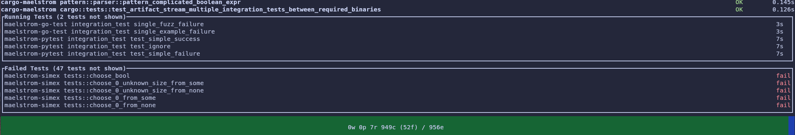

+++
title = "Maelstrom 0.12.0 Release"
date = 2024-09-16
weight = 1000
+++

We're excited to announce Maelstrom 0.12.0. In this release, we made a lot of
usability improvements to the Maelstrom test runners.

<!-- more -->

## Test Priorities

In Maelstrom 0.9.0, we introduced the feature where tests are run in [LPT
order](https://en.wikipedia.org/wiki/Longest-processing-time-first_scheduling).
Maelstrom uses tests' historical run times to predict future run times, and
then schedules the tests that are predicted to take the longest time first.
This is really great way to shorten the makespan (total time it takes to run a
batch of tests) without a lot of work. Computing a schedule that gives a
minimal makespan is NP-hard, but LPT scheduling gives us makespans that are no
worse than 133% of the optimal schedule.

With this release, Malestrom now has an improved scheduling algorithm.
Maelstrom now keeps track of which tests are new and which tests failed the
last time they were run. Now, new tests always have highest priority, followed
by tests that failed the last time they were run, followed by all other tests.
Within a priority band, LPT scheduling is still used.

We've found this substantially improves the edit-compile-test loop. We find out
immediately if our changes work, whether they are newly added tests or fixes to
broken tests.

## New <tt>stop-after</tt> Configuration Value

This release introduces the <tt>stop-after</tt> configuration value. When this
is set, Maelstrom will bail out early if the given number of failures are
encountered.

This change pairs well with the new scheduling changes. For instance, if you
run `cargo maelstrom --stop-after=1` it will exercise your new tests first and
bail out immediately if any of them fail. Then, while you're fixing your code,
Maelstrom will run all of the tests that previously failed first, and bail out
if any of them fail again. This dramatically reduces the latency of the
edit-compile-test loop.

## Passing Extra Arguments to Test Binaries and Pytest

Maelstrom 0.12.0 adds the ability to pass arbitrary arguments to the underlying
test binaries.

For example:
- `cargo maelstrom -- --force-run-in-process` passes <tt>-\-force-run-in-processs</tt>
  to the Rust test binaries when running tests.
- `maelstrom-go-test -- -test.parallel 12` passes <tt>-test.parallel 12</tt> to the Go
  test binaries when running tests.
- `maelstrom-pytest -- -n1` passes </tt>-n1</tt> to Pytest when running tests.

In addition, the <tt>extra-pytest-collect-args</tt>,
<tt>extra-pytest-test-args</tt>, and <tt>extra-pytest-args</tt> configuration
values can be used to tell <tt>maelstrom-pytest</tt> to pass extra arguments to
Pytest in the collect phase, in the test-running phase, or both, respectively.

## More Configuration Values for <tt>maelstrom-go-test</tt>

Malestrom 0.12.0 updates <tt>maelstrom-go-test</tt> with more configuration
values that add functionality found in <tt>go test</tt>:
- <tt>vet</tt>
- <tt>short</tt>
- <tt>fullpath</tt>

Also, `maelstrom-go-test --list-packages` now works, similar to how `cargo
maelstrom --list-packages` does.

## Shared-Library Dependencies

This release of Maelstrom adds a new layer type called
<tt>shared-library-dependencies</tt>, which includes the closure of shared
libraries required to run a list of binaries. This makes it easier to include
external binaries and their dependencies in test containers.

## Better Default Metadata

All of the tests runners in Maelstrom 0.12.0 now have updated default metadata
configurations. These are now test-runner-specific. For example, <tt>cargo
maelstrom</tt> now forwards <tt>RUST\_BACKTRACE</tt> and <tt>RUST\_LIB\_BACKTRACE</tt>.

With this change, the Python test runner is now significantly easier to use
out-of-the-box.

## UI Improvements

This release features an improved test-runner UI:
- Both the <tt>fancy</tt> and <tt>simple</tt> UIs now show the counts of tests
  in each various state.
- The <tt>fancy</tt> UI now includes a listing of failed tests during the test
  run. Before, this was only shown in a summary at the end of the test run.
- The <tt>simple</tt> UI now includes a running count of failed tests.

See the [0.12.0 release notes](https://github.com/maelstrom-software/maelstrom/releases/tag/v0.12.0)
for a complete list of changes.
